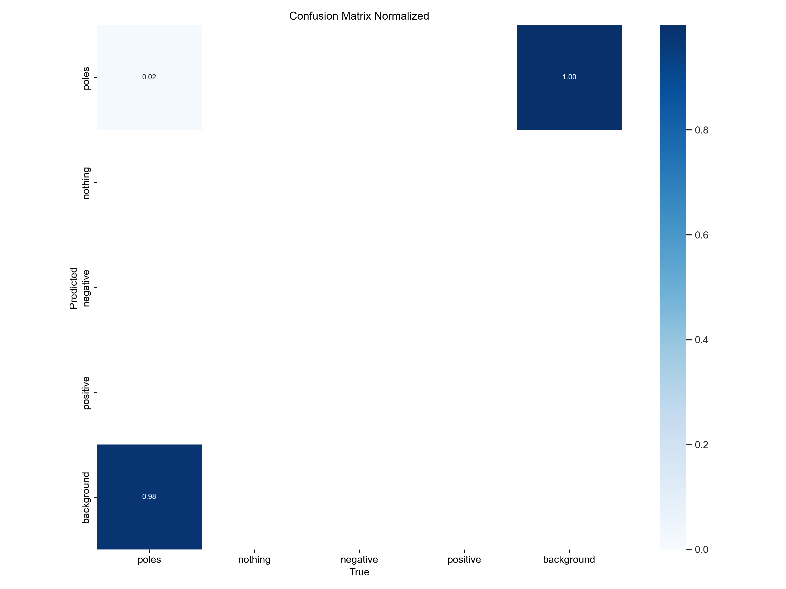

- pane peatükid või mõtted kirja jooksvalt  
- proovi resnext v muu mudelit  
- järgmise treening hulga märgistamine  
- pane ideed rakenduse jaoks kirja  

Praegused ideed:
 - rakendus võiks kasutada etalon plaadi manuaalset märkimist ja siis sellega järgnevate võrdlemist, saab arvutada nurkasid skeletoni põhjal, kuidas asetsevad osad ning seda kasutada vigaselt asetatud juppida nägemiseks
 - algne testimiseks loodud 400 pildine treening hulk ei andud häid tulemusi kuid seda oli ka oodata, järgnevas treening hulgas on rohkem andmeid
 
 - kuigi pose estimation loss muutus väga väikeseks on siiski mure et enamus asju jääb tuvastamata, kindlus on väga madal, 
  
  
  
OBB saab luua kui kasutada juba märgendatud skelette, võtan pooluste vahemaa ruudu külje pikkuseks ja muudan skeletti joone keskteljeks